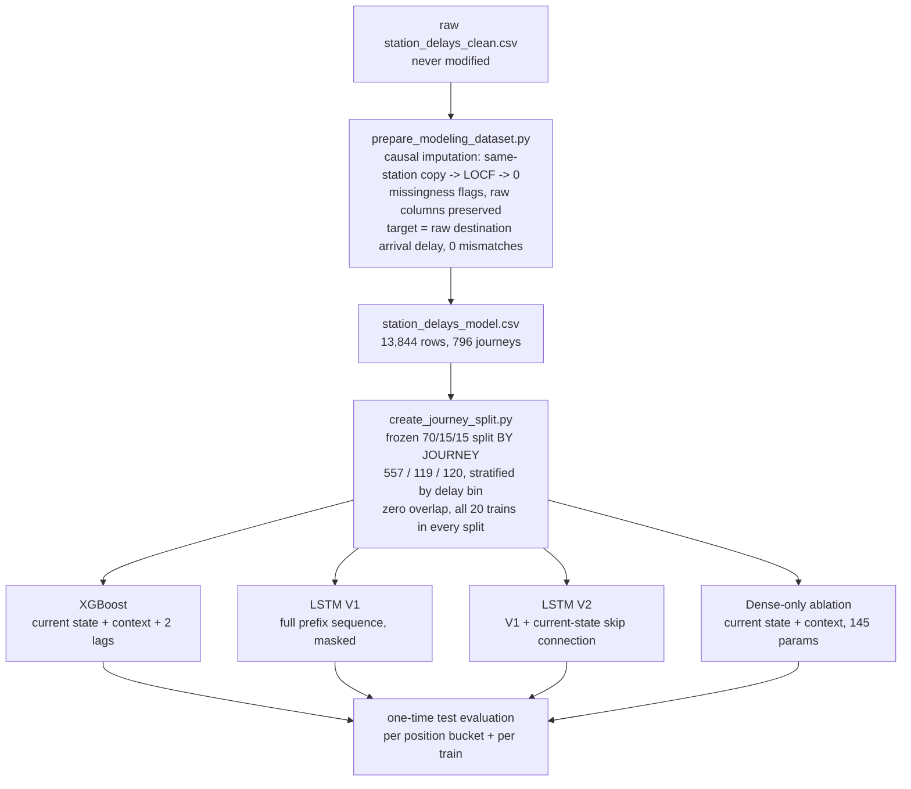

# Railway Delay Forecasting — Predicting Final Arrival Delay Mid-Journey

Predict how late a long-distance Indian train will arrive at its final destination, using only what has been observed of the journey so far. We first obtained apparently strong results, then discovered future-information leakage in the preprocessing pipeline. After rebuilding the data causally and freezing a journey-level split, XGBoost achieved 18.37-minute test MAE. A full-history LSTM reached 19.34; adding a direct current-state skip connection improved it to 18.79. A dense-only ablation degraded to 19.64, demonstrating that full journey history adds measurable but modest predictive value. XGBoost remains the practical winner, while the LSTM experiments establish the value and limits of sequence modeling on this dataset.

## Problem statement

At station *k*, immediately after departure, predict the journey's **final destination arrival delay** using only stations 1..*k*. Every non-destination station row is one prediction sample; the destination row is never an input. All features, imputation, and evaluation respect this causality constraint.

## Dataset

- 20 daily trains (10 up/down route pairs: Shatabdi, Rajdhani, superfast expresses), collected from the RailRadar API
- **796 journeys**, **13,844 station records**, 47 dates (2026-05-01 → 2026-06-20)
- Route lengths 359–3,030 km (8–44 halts); halt set is fixed per train
- Target is zero-inflated and skewed: 42 % of journeys arrive exactly on time; 15 journeys exceed 300 min (max 1,093)

## The leakage discovery

The original pipeline filled missing delays with bidirectional linear interpolation — using **future stations to fill earlier values**. Real example (diverted journey `12627_2026-05-15`, four stations unreported between a 58-min and an 821-min observation):

```
leaked  : 58 → 210.6 → 668.4 → 821   (ramp interpolated backwards from the future)
causal  : 58 →  58   →  58   → 821   (last observation carried forward)
```

The leaked version encodes the future disruption inside the inputs, inflating offline metrics with information that cannot exist at prediction time. 1,905 departure and 144 arrival values (81 % of journeys) were affected, so the dataset was rebuilt causally and all models retrained.

## Methodology



**Technology note:** the sequence models are written with the **Keras 3 API** (`keras.Model`, `keras.layers.LSTM`, `keras.layers.Dense`, Keras callbacks and `fit()`), running on the **PyTorch backend** (`KERAS_BACKEND=torch`, set inside each training script before Keras is imported). PyTorch serves only as the computation backend — the models are not native PyTorch implementations — and **TensorFlow is not required**.

## Model comparison (frozen test results, 120 unseen journeys)

| model | test MAE (min) | test RMSE | test R² |
|---|---|---|---|
| Naive departure carry-forward | 28.98 | 56.30 | 0.815 |
| Naive arrival carry-forward | 26.28 | 56.01 | 0.817 |
| Dense-only (current state + context, 145 params) | 19.64 | 54.56 | 0.8262 |
| LSTM V1 (full history, 5,441 params) | 19.34 | 55.32 | 0.8213 |
| LSTM V2 (history + current-state skip, 5,521 params) | 18.79 | **53.54** | **0.8327** |
| **XGBoost** (current state + context + 2 lags) | **18.37** | 53.65 | 0.8320 |

## Experiment ladder

Each step changed exactly one thing, so every difference is attributable:

1. **Naive carry-forward (26.28)** — serious baseline: current delay correlates 0.99 with final delay late in the journey.
2. **XGBoost (18.37)** — learns end-of-route recovery; frozen benchmark.
3. **LSTM V1 (19.34)** — full history through a masked 32-unit LSTM; loses exactly where current state matters most (80–100 % bucket: 10.77 vs XGBoost 6.98) because the current station passes through the recurrent bottleneck.
4. **LSTM V2 (18.79)** — one change: current-state skip connection. Late bucket 10.77 → 8.21; confirms the bottleneck diagnosis; statistical tie with XGBoost (V2 wins RMSE and R²).
5. **Dense-only ablation (19.64)** — removing history costs 0.85 min MAE; V2 beats it in all five position buckets, most around 60–80 % completion.

Figures (in [reports/figures/](reports/figures)): [test MAE](reports/figures/fig1_test_mae.png) · [test RMSE](reports/figures/fig2_test_rmse.png) · [test R²](reports/figures/fig3_test_r2.png) · [MAE by journey position](reports/figures/fig4_bucket_mae.png) · [ablation ladder](reports/figures/fig5_ablation_ladder.png) · [per-train MAE](reports/figures/fig6_per_train_mae.png) · [failure case](reports/figures/fig7_failure_case.png)

## Main findings

- **Causality is the project's real result**: leaked interpolation had made earlier metrics unfairly optimistic; every frozen number above is causally clean.
- **Current state + route context carries most of the signal** — a 145-parameter dense net reaches 19.64 MAE.
- **Full journey history adds measurable but modest value** (~0.9 min test MAE, concentrated at 60–80 % journey completion).
- **Two lag features ≈ full sequence history** on this dataset — hence XGBoost's parity with the LSTM.
- **Late-onset disruptions are unpredictable from station history alone** (a train on time for 72 % of its route then +380 min); they bound every causal model and dominate the remaining error.

## Limitations

796 journeys, 20 fixed routes (models partly learn route identity), zero-inflated target, 15 extreme journeys dominating RMSE, no external operational data (weather, congestion, signal failures), and a random (not temporal) split. See §13 of the technical report.

## Project structure

```
data/raw/station_delays_clean.csv        # source data (never modified; NOT committed - see data policy)
data/processed/station_delays_model.csv  # causal modeling dataset (NOT committed - regenerable)
data/processed/journey_split.csv         # frozen 70/15/15 journey split (committed)
data/processed/*_report.txt              # frozen experiment reports (committed)
notebooks/                               # historical exploration ONLY - 01_eda.ipynb contains
                                         # the ORIGINAL LEAKY pipeline kept as documentation
src/data_collection.py                   # RailRadar API scraper (needs RAILRADAR_API_KEY env var)
src/prepare_modeling_dataset.py          # causal preprocessing + validation
src/create_journey_split.py              # split creation + merge_split() helper
src/train_xgboost_baseline.py            # frozen XGBoost benchmark
src/train_lstm_baseline.py               # Keras 3 LSTM V1 (PyTorch backend)
src/train_lstm_v2.py                     # Keras 3 LSTM V2 (current-state skip)
src/train_dense_ablation.py              # dense-only ablation
src/create_final_analysis.py             # audit + final figures (no training)
reports/final_technical_report.md        # full technical story
reports/final_metrics_audit.txt          # cross-report consistency audit
reports/figures/                         # comparison figures
```

## Data availability & policy

The station-level running data was collected from the commercial [RailRadar](https://railradar.in) API. Because redistribution rights for API-derived data are not clearly established, **the CSV datasets are not committed to this repository** (see `.gitignore`). What *is* committed: all frozen experiment reports, the frozen journey-split assignment (train numbers, dates, and split labels only), the audit, and the figures — so every reported number remains verifiable.

To reproduce the dataset locally:

1. Obtain a RailRadar API key and set `RAILRADAR_API_KEY` in your environment.
2. Run `python src/data_collection.py` (edit `TRAIN_NUMBERS` / `DATES` in the script) → `data/raw/`.
3. Consolidate/clean to `data/raw/station_delays_clean.csv` with these columns: `journey_date, train_number, train_name, train_type, category, source_station, destination_station, station_sequence, station_code, station_name, distance_km, platform, status, scheduled_arrival, actual_arrival, scheduled_departure, actual_departure, arrival_delay_minutes, departure_delay_minutes`.
4. Run the pipeline below. Note: freshly collected data will differ from the May–June 2026 collection window, so retrained metrics will differ from the frozen ones; the frozen reports document the original experiments.

The data contains public operational information only (train schedules and delays) — no personal information.

## Reproducibility

```bash
pip install -r requirements.txt   # includes keras>=3 and torch; TensorFlow is NOT needed
```

**Keras backend:** every deep-learning script sets `KERAS_BACKEND=torch` via `os.environ.setdefault(...)` *before* importing Keras, so the PyTorch backend is selected reproducibly with no manual configuration. To override the default in your own shell instead: `export KERAS_BACKEND=torch` (bash) or `$env:KERAS_BACKEND = "torch"` (PowerShell).

```bash
# non-training verification (works with data/reports present):
python src/create_final_analysis.py      # re-audits all frozen reports, rebuilds figures

# full pipeline (requires data/raw/station_delays_clean.csv; retrains models):
python src/prepare_modeling_dataset.py   # causal preprocessing (hard-asserted)
python src/create_journey_split.py       # deterministic split (seed 42, byte-identical)
python src/train_xgboost_baseline.py
python src/train_lstm_baseline.py        # Keras 3 on the torch backend
python src/train_lstm_v2.py
python src/train_dense_ablation.py
```

All scripts are deterministic (seed 42), run from any working directory (project-relative `pathlib` paths), fit scalers on training data only, share the frozen journey split via `merge_split()`, and evaluate the test set exactly once.
